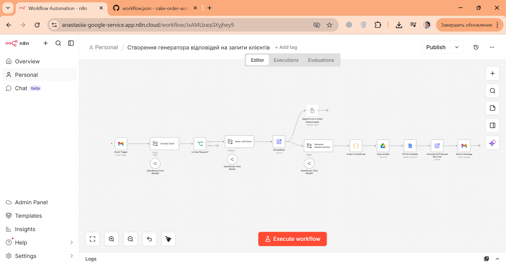

# 🎂 Cake Order Automation — AI-powered email response generator

Автоматизація на базі n8n, яка обробляє вхідні листи від клієнтів, визначає запити на купівлю тортів, генерує персоналізовані комерційні пропозиції та відправляє їх клієнту — без участі менеджера.



---

## 📌 Бізнес-задача

Власники невеликих кондитерських щодня отримують десятки листів: запити клієнтів, резюме, листи від постачальників, спам. Менеджери витрачають багато часу на ручну обробку кожного листа.

Цей workflow вирішує проблему: він сам читає пошту, розпізнає справжні запити на торти та миттєво відправляє клієнту готову комерційну пропозицію.

---

## ⚙️ Як це працює

1. **Тригер** — Gmail відстежує вхідні листи щохвилини
2. **Класифікація** — AI визначає, чи є лист запитом на купівлю торта
3. **Фільтр** — листи не по темі ігноруються
4. **Витяг даних** — AI зчитує ім'я клієнта та кількість тортів
5. **Розрахунок ціни** — автоматично: кількість тортів × 1000 грн
6. **Генерація КП** — копіюється шаблон Google Docs, плейсхолдери замінюються на дані клієнта
7. **Відправка** — клієнт отримує email з посиланням на персональну комерційну пропозицію

---

## 🛠 Стек

| Інструмент | Роль |
|---|---|
| n8n | Оркестрація workflow |
| Gmail API | Тригер + відправка відповідей |
| OpenRouter / OpenAI | Класифікація листів, витяг даних, генерація тексту КП |
| Google Docs API | Копіювання шаблону та заміна плейсхолдерів |
| Google Drive API | Зберігання згенерованих документів |
| Google Sheets | Логування вхідних запитів (бонус) |

---

## 🚀 Як запустити

### 1. Імпортувати workflow
- Відкрий n8n → **Import from file** → обери `workflow.json`

### 2. Підключити credentials
- **Gmail OAuth2** — через Google Cloud Console
- **Google Docs / Drive / Sheets OAuth2** — той самий акаунт
- **OpenRouter API** — отримати ключ на [openrouter.ai](https://openrouter.ai)

### 3. Підготувати шаблон Google Docs
Створи документ з такими плейсхолдерами:

```
{{date}}       — дата КП
{{name}}       — ім'я клієнта
{{request}}    — короткий опис запиту
{{solution}}   — персоналізована пропозиція
{{count}}      — кількість тортів
{{price}}      — сума (count × 1000 грн)
```

Скопіюй ID документа з URL і встав у ноду `Copy Google Doc Template`.

### 4. Активувати workflow
Переключи тумблер **Active** у правому верхньому куті n8n.

---

## 📊 Результат

Клієнт отримує відповідь протягом хвилини після відправки листа — з персональним зверненням, описом замовлення та посиланням на готову комерційну пропозицію в Google Docs.

---

## 📁 Структура репозиторію

```
cake-order-automation/
├── README.md
├── workflow.json        
└── assets/
    └── workflow.png    
```

---

## 💡 Можливі розширення

- Підключити Telegram-бота для сповіщень менеджера
- Додати обробку PDF-прайслистів через AI
- Адаптувати під іншу нішу (юридичні послуги, фотографи, event-агентства)

---

*Проєкт виконаний у рамках навчання автоматизації бізнес-процесів на базі n8n.*